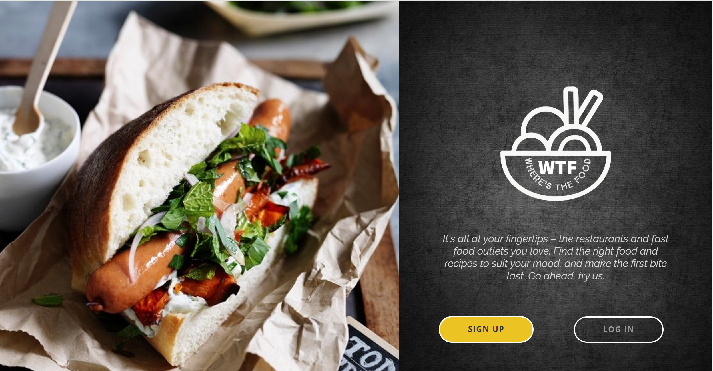
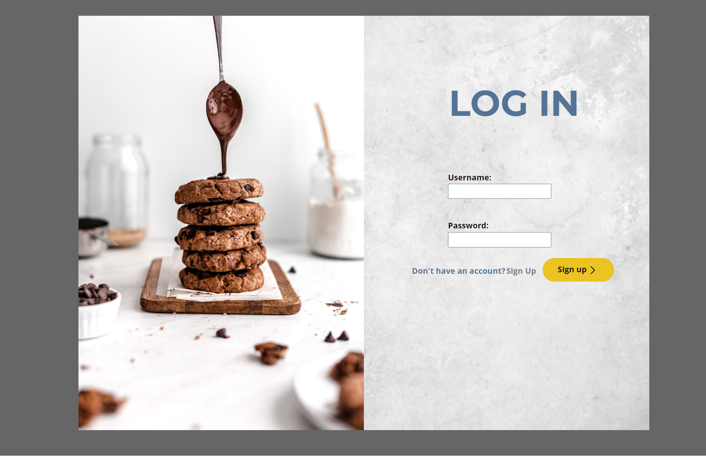
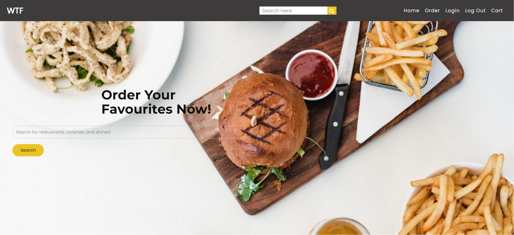
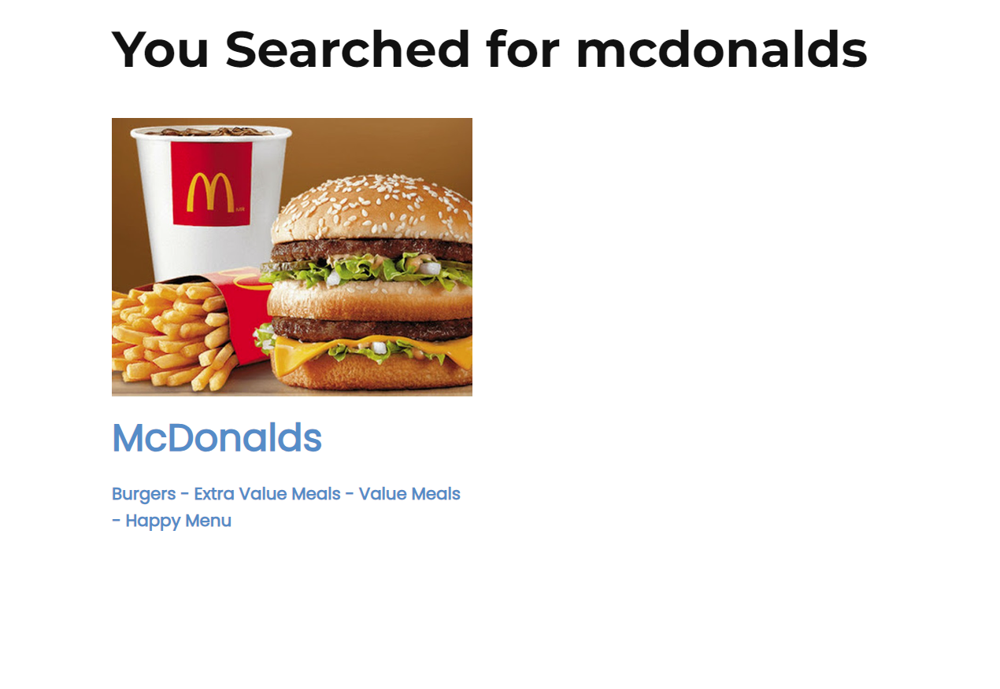
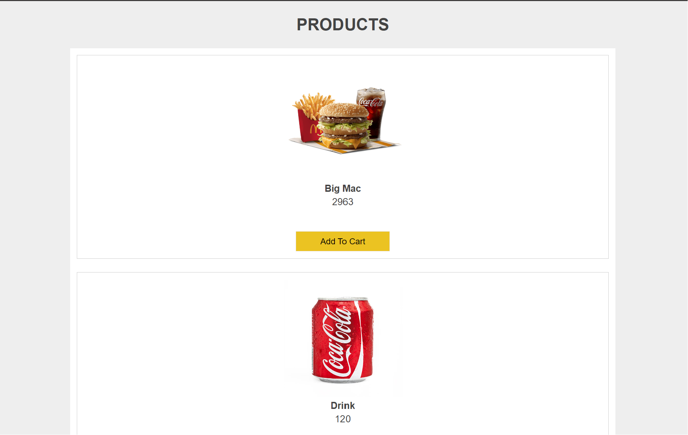
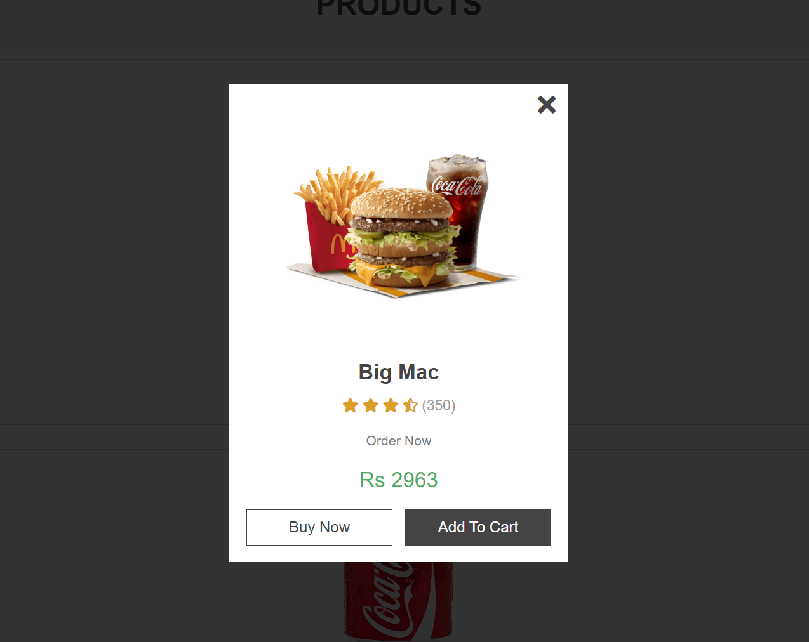
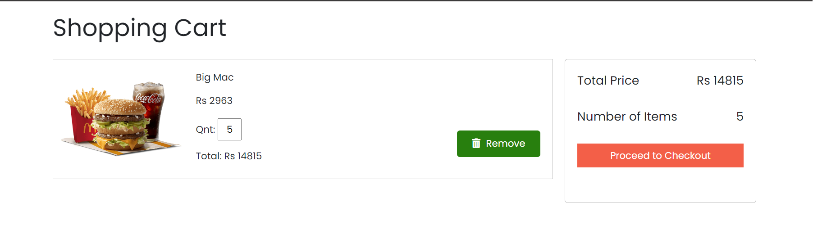
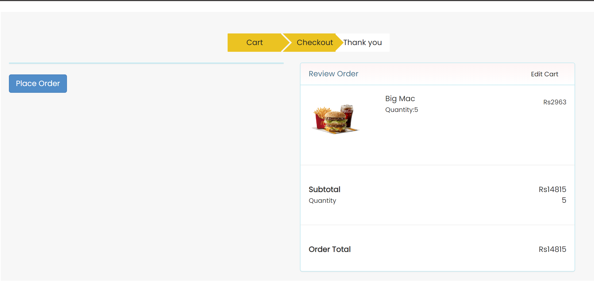
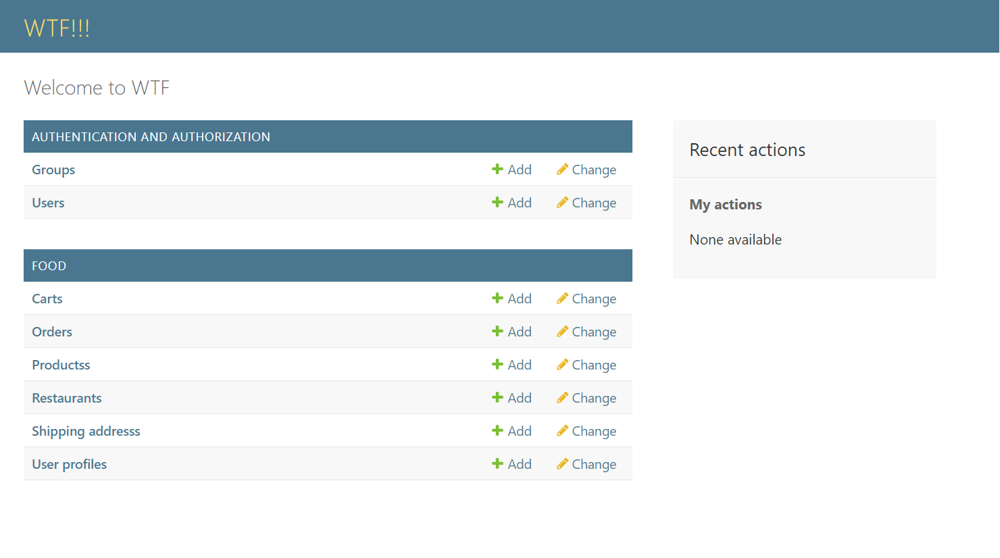

# Food Ordering Website (Django)

A robust Django-based food ordering website with admin and user interfaces, featuring a seamless search experience, user-friendly shopping cart, comprehensive product management, secure checkout, user authentication, and order tracking. Responsive design ensures optimal user experience.

## Features

- **User Authentication:** Allow users to create accounts and log in.

- **Search Functionality:** Quickly find desired food items using the search bar.

- **Shopping Cart:** Add, remove, and update items in the shopping cart before checkout.

- **Checkout Process:** Smooth and secure checkout process with multiple steps for a seamless user experience.

- **User and Admin Interfaces:** Easily manage and order food items, users and orders with dedicated user and admin interfaces.

## Getting Started

1. git clone https://github.com/Aeiman191/FoodOrderingWebsite_Django.git

2. pip install Django

3. python manage.py migrate

4. python manage.py runserver
   Visit http://127.0.0.1:8000/ to access the website locally.

### Admin

1. python manage.py createsuperuser

2. Login to your admin account at http://127.0.0.1:8000/admin
